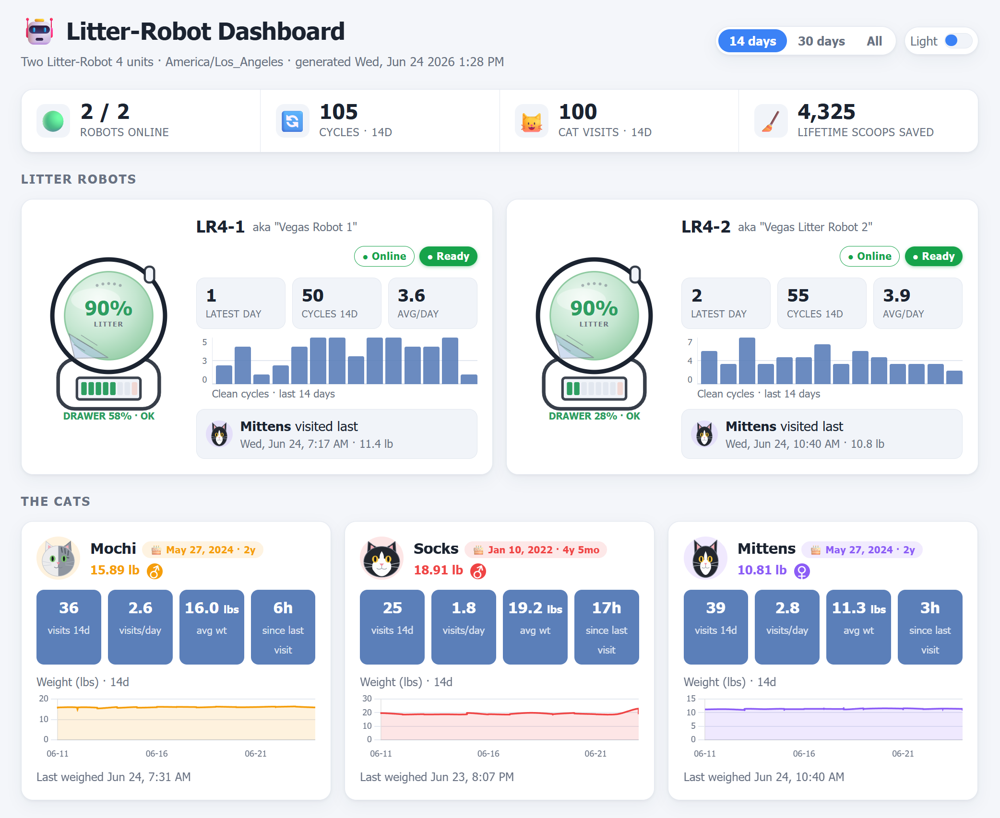

# Litter Robot Dashboard

Monitoring, logging, and dashboards for two Litter-Robot 4 units, built on the
[`pylitterbot`](https://pypi.org/project/pylitterbot/) Whisker API.

## Introduction

This repository shares the Litter-Robot dashboard I built to track the litter and
health habits of my cats. A Litter-Robot is an automated, self-cleaning cat litter
box: after a cat uses it, it sifts the waste into a sealed waste drawer, keeping the
box clean and giving each cat a fresh bed of litter. Because every cleaning cycle and
every visit is recorded in the cloud, there's a surprising amount you can learn about
your cats from it — how often they go, how much they weigh, and whether anything looks
off.

The dashboards surface a few things at a glance. First, the real-time **status** of
each robot — whether it's online, the current litter level, how full the waste
drawer is, cycle counts, and any faults. Second, the cats' **usage and health
trends** over time — visit frequency, cat detections, and recorded weights — drawn
from each robot's activity history. Watching weight and bathroom habits over time can
be an early hint that something's wrong, which is the real reason I started logging
all of this. Third, the health of the **collection job** itself, so I can tell at a
glance that the data is still flowing.

I run two Litter-Robot 4 units (**LR4-1** and **LR4-2**), and the data behind the
dashboards comes from the Whisker API via the included monitor script.

## How it works

The whole thing is a small pipeline, and you can follow it end to end:

1. **Collect** — a Python script (`code/litter_robot_v1.py`) logs into the Whisker
   cloud, reads each robot's current status and recent activity, and appends what it
   finds to CSV files.
2. **Schedule** — a Windows scheduled task runs that script automatically on a timer,
   so the history builds up on its own without anyone remembering to run it.
3. **Visualize** — on each run the script rebuilds three self-contained HTML
   dashboards (litter status, cat health, and batch-run monitoring) from that
   history. Each is a single file you can open in any browser, linked by a shared
   nav bar at the top.
4. **Deploy (optional)** — if the AWS environment variables are set, the script
   uploads all three dashboards to S3 and invalidates the CloudFront cache so the
   live site refreshes within seconds. If they aren't set, it simply notes that and
   keeps going.

Nothing here needs a server or a database — it's just a script, some CSV files, and
HTML pages. That keeps it easy to run, back up, and share.

## The robots

The two robots have been renamed over time, so older export files use the previous
names. This table is the key for matching them up:

| Current name | Former name          |
|--------------|----------------------|
| **LR4-1**    | Vegas Robot 1        |
| **LR4-2**    | Vegas Litter Robot 2 |

## Dashboards

<!-- Screenshot goes here. To add it: open dashboards/litter_robot_dashboard.html
     in a browser, capture it, save it as dashboards/dashboard_screenshot.png, then
     uncomment the line below.

-->

There are three dashboards, linked by a nav bar at the top of each (and each has a
light/dark toggle):

- **Litter Robots** (`litter_robot_dashboard.html`) — real-time status of both robots
  plus cat usage and weight trends.
- **Cat Health** (`cat_health_dashboard.html`) — a per-cat wellness view (weight
  trend, litter frequency, and a derived health score) with a 14 / 30 / Max range
  selector.
- **Batch Runs** (`batch_run_dashboard.html`) — a monitor for the collection job
  itself: the latest run, how fresh it is, and a sortable table of every run with
  duration color-coded against the average.

To see them, just open any file in `dashboards/` in a web browser — no install or
internet connection required, since the data is baked right into each file.

## Folder layout

Everything is sorted into four folders so it's easy to find what you need:

```
.
├── code/                scripts: monitor (litter_robot_v1.py) + Windows scheduling + AWS deploy
├── dashboards/          generated HTML dashboards + their templates
├── live_logs/           current monthly logs the monitor appends to each run
└── historical_exports/  older raw activity CSVs exported from the Whisker app
```

The short version: **code** is what runs, **dashboards** is what you look at, and the
two log folders are the data. `live_logs/` is the data this project collects on its
own; `historical_exports/` is older data I downloaded by hand from the Whisker app
before the script existed. The scheduled task runs
`code/litter_robot_v1.py --log-dir <...>/live_logs`, so every new row lands in
`live_logs/`.

## What's here

### Code (`code/`)

- **`litter_robot_v1.py`** — the main monitor, and the heart of the project. It
  connects to the Whisker account and pulls down just about everything the robots
  know: full device status and diagnostics, the complete activity archive, usage
  insights (including cat detections), the sleep schedule, firmware status, and each
  pet's profile and weight history. It's built to run over and over (say, every
  hour): each run appends to the monthly CSV logs and quietly skips anything it has
  already recorded, then rebuilds and (optionally) deploys all three dashboards.

### Scheduling, Windows (`code/`)

These small helper scripts set up and manage the automatic timer. You'll mostly just
double-click them.

- **`schedule_litter_robot.ps1`** — registers the recurring Windows scheduled task.
- **`schedule_tonight.bat`** — double-click to (re-)register the task.
- **`check_schedule.bat`** — dumps the task's status and diagnostics to a text file
  so you can confirm it's actually running.
- **`uninstall_schedule.bat`** — removes the scheduled task.
- **`setup_github.ps1`** — one-time helper that sets up git and pushes to GitHub.
- **`s3_deploy_check.py`** — standalone diagnostic that tries to upload all three
  dashboards and prints the exact result/error per file. Run:
  `python code/s3_deploy_check.py --list`.
- **`aws_dashboard_policy.json`** — the IAM policy the deploy credentials need (kept
  out of git via `.gitignore` because it contains your AWS account ID).

### Dashboards (`dashboards/`)

The script regenerates all three dashboards on every run, so don't hand-edit the
output HTML — edit the matching `*_template.html` instead (the script fills in the
data placeholders).

- **`litter_robot_dashboard.html`** — robot status + cat usage/weight trends.
- **`cat_health_dashboard.html`** — per-cat wellness view with a 14 / 30 / Max range selector.
- **`batch_run_dashboard.html`** — collection-job run monitor (latest run + sortable history).
- **`*_template.html`** — the three matching templates the dashboards are built from;
  edit these to restyle or rebuild.

## CSV reference

If you ever want to open the raw data in Excel or build your own charts, here's what
each file and column means. Don't worry about memorizing this — it's just a lookup.

### `live_logs/` — generated by the monitor

**`litter_robot_logs_MM-YYYY.csv`** — robot status snapshots. The script writes one
row per robot per run, but only when something actually changed since the last
snapshot, so the file stays compact.

| Column | Meaning |
|--------|---------|
| `snapshot_time` | When the snapshot was taken |
| `robot` | LR4-1 or LR4-2 |
| `serial`, `model` | Device serial and model |
| `online`, `status` | Connectivity and current state (e.g. Ready) |
| `litter_pct`, `litter_state` | Litter level % and state (e.g. OPTIMAL) |
| `waste_drawer_pct`, `drawer_full` | Waste drawer fill % and full flag |
| `cycle_count`, `cycle_capacity`, `cycles_after_full` | Clean-cycle counters |
| `scoops_saved` | Lifetime scoops saved |
| `last_pet_weight_lbs` | Most recent measured pet weight (lb) |
| `clean_wait_min` | Clean-cycle wait time (minutes) |
| `sleep_active` | Whether sleep mode is active |
| `hopper_status` | Litter hopper status |
| `globe_motor_fault`, `usb_fault` | Fault indicators |
| `wifi_mode` | Wi-Fi connection mode |
| `firmware` | ESP / PIC / TOF firmware versions |

**`litter_robot_usage_logs_MM_YYYY.csv`** — the activity feed: every cat detection,
weigh-in, and clean cycle, one row per event.

| Column | Meaning |
|--------|---------|
| `Robot` | LR4-1 or LR4-2 |
| `Activity` | Event type (e.g. Cat Detected, Clean Cycle Complete) |
| `Timestamp` | When it occurred |
| `Value` | Associated value (e.g. weight), or `-` if none |

**`litter_robot_applog.csv`** — a simple run journal: one row each time the script
runs, so you can confirm it's working and see how long it took. This file is what the
**Batch Runs** dashboard is built from.

| Column | Meaning |
|--------|---------|
| `run_time` | When the run started |
| `duration_sec` | Run duration in seconds |
| `status` | `ok` or `error` |
| `error` | Error detail if the run failed |

### `historical_exports/` — manual exports from the Whisker app

These are older activity exports I downloaded by hand before the script existed. The
robot is identified by the **filename** (`lr4-1_*` / `lr4-2_*`, or the older
`vegas_robot_1_*` / `vegas_litter_robot_2_*`), so the rows themselves don't repeat the
robot name.

| Column | Meaning |
|--------|---------|
| `Activity` | Event type (e.g. Clean Cycle Complete) |
| `Timestamp` | When it occurred |
| `Value` | Associated value, or `-` if none |

## Setup

You only need to do this once. The script auto-installs its two dependencies
(`pylitterbot` and `boto3`) on first run, or you can install them yourself:

```bash
pip install pylitterbot boto3
```

Then give the script your Whisker login. It reads these from environment variables so
your password never has to live inside the code (and never ends up in this repo):

```powershell
# Windows PowerShell (current session)
$env:WHISKER_USERNAME="you@example.com"
$env:WHISKER_PASSWORD="your-password"
```

```bash
# macOS / Linux
export WHISKER_USERNAME="you@example.com"
export WHISKER_PASSWORD="your-password"
```

The lines above set the variables for your current terminal session only. To make
them stick for the automatic scheduled task, see the **Scheduled task** section below.

## Run

Once setup is done, run the monitor from the repo root. Each run prints a readable
report and appends any new data to the logs:

```bash
python code/litter_robot_v1.py --log-dir live_logs     # run + append to live_logs/
python code/litter_robot_v1.py --log-dir "C:\path"     # write logs elsewhere
python code/litter_robot_v1.py --log-dir live_logs --no-deploy   # skip the S3/CloudFront upload
python code/litter_robot_v1.py --log-dir live_logs > report.txt  # also save the console report
```

If you skip `--log-dir`, the script writes the logs next to itself (inside `code/`),
so it's worth pointing it at `live_logs/` as shown.

## Scheduled task (Windows)

Running the script by hand works, but the real value comes from letting it run on its
own so the history fills in around the clock. On Windows that's a scheduled task:

- **Register / re-register:** double-click `code\schedule_tonight.bat` (it runs
  `schedule_litter_robot.ps1` for you). It will ask for administrator rights and your
  Windows password — the password lets the task run *whether or not you're logged on*.
  Re-run this any time you move files, so the task picks up the current
  `code\litter_robot_v1.py` path.
- **Schedule:** the task `LitterRobotHourly` runs once an hour, indefinitely, around the clock.
- **Output:** the task passes `--log-dir ...\live_logs`, so logs land in `live_logs/`.
- **Credentials & config:** because the task runs on its own (and may run under a
  separate local account), the per-session variables aren't enough — set everything
  it needs as **machine-level** variables. In an elevated PowerShell (Run as
  administrator):

  ```powershell
  [Environment]::SetEnvironmentVariable("WHISKER_USERNAME","you@example.com","Machine")
  [Environment]::SetEnvironmentVariable("WHISKER_PASSWORD","your-password","Machine")
  ```

  Then reboot (or restart) so Task Scheduler picks up the new machine environment. To
  also deploy from the scheduled task, set the AWS variables described below the same
  way.
- **Check status:** double-click `code\check_schedule.bat` to confirm it's running.
- **Remove:** double-click `code\uninstall_schedule.bat`.

## Deploying to S3 + CloudFront

On every run, after rebuilding the three dashboards, the script uploads all of them
to S3 and invalidates the CloudFront cache so the live site refreshes within seconds.
Skip it for a local run with `--no-deploy`.

The deploy **target** is read from environment variables, so nothing about your AWS
setup is hard-coded in the repo. If they aren't set, the script prints a note and
keeps going — it never errors out.

| Variable | Purpose | Required? |
|----------|---------|-----------|
| `LITTERBOT_S3_BUCKET` | S3 bucket to upload to | Yes (no upload without it) |
| `LITTERBOT_CLOUDFRONT_DISTRIBUTION_ID` | CloudFront distribution to invalidate | Optional (uploads still happen; just no cache invalidation) |
| `LITTERBOT_AWS_REGION` | AWS region | Optional (defaults to `us-east-1`) |

Set them once, machine-wide so the scheduled task sees them, in an elevated
PowerShell:

```powershell
[Environment]::SetEnvironmentVariable("LITTERBOT_S3_BUCKET","your-bucket","Machine")
[Environment]::SetEnvironmentVariable("LITTERBOT_CLOUDFRONT_DISTRIBUTION_ID","YOUR_DIST_ID","Machine")
[Environment]::SetEnvironmentVariable("LITTERBOT_AWS_REGION","us-east-1","Machine")
```

All three dashboards are uploaded under these keys (in your bucket):
`litter_robot_dashboard.html`, `cat_health_dashboard.html`, `batch_run_dashboard.html`.
Each upload is independent, so one failure never blocks the others, and the script
prints an `N/3 succeeded` summary.

**AWS credentials** are separate from the config above — `boto3` reads them from the
standard chain (env vars, `~/.aws/credentials`, or an IAM role). For the unattended
scheduled task, set them machine-wide too:

```powershell
[Environment]::SetEnvironmentVariable("AWS_ACCESS_KEY_ID","<your-key-id>","Machine")
[Environment]::SetEnvironmentVariable("AWS_SECRET_ACCESS_KEY","<your-secret>","Machine")
```

**IAM permissions.** The credentials need `s3:PutObject` on the whole bucket prefix
(so all three files can upload) plus `cloudfront:CreateInvalidation`. A ready-to-edit
policy lives in `code/aws_dashboard_policy.json` (gitignored). Replace the
placeholders with your bucket, account ID, and distribution ID:

```json
{
  "Version": "2012-10-17",
  "Statement": [
    { "Effect": "Allow", "Action": "s3:PutObject",
      "Resource": "arn:aws:s3:::YOUR_BUCKET/*" },
    { "Effect": "Allow", "Action": "cloudfront:CreateInvalidation",
      "Resource": "arn:aws:cloudfront::YOUR_ACCOUNT_ID:distribution/YOUR_DIST_ID" }
  ]
}
```

If a deploy isn't landing, run `python code/s3_deploy_check.py --list` — it prints the
AWS identity in use and the exact per-file upload result.

## Security

Credentials and deploy configuration are read from environment variables only — there
are no passwords, keys, or AWS account identifiers in the tracked code. Please don't
commit passwords, tokens, or API keys; keep them in the environment variables
described above.

`.gitignore` is set up to keep sensitive and scratch material out of the repo,
including `.env` / secrets files, `code/aws_dashboard_policy.json` (contains your AWS
account ID), and the `_to_delete/` scratch folder plus `*litter_robot_code_output*.txt`
console dumps (which can contain account IDs, pet profile IDs, presigned URLs, and
device serials).

One thing to decide before publishing: device **serial numbers** also appear in
`live_logs/litter_robot_logs_*.csv`. They aren't secrets, but if you'd rather not
publish them, scrub the `serial` column or gitignore the log/export folders before
pushing.
